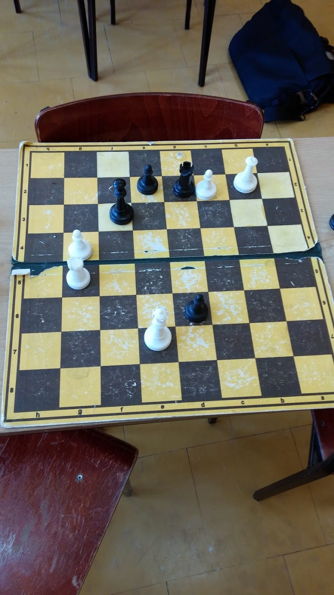
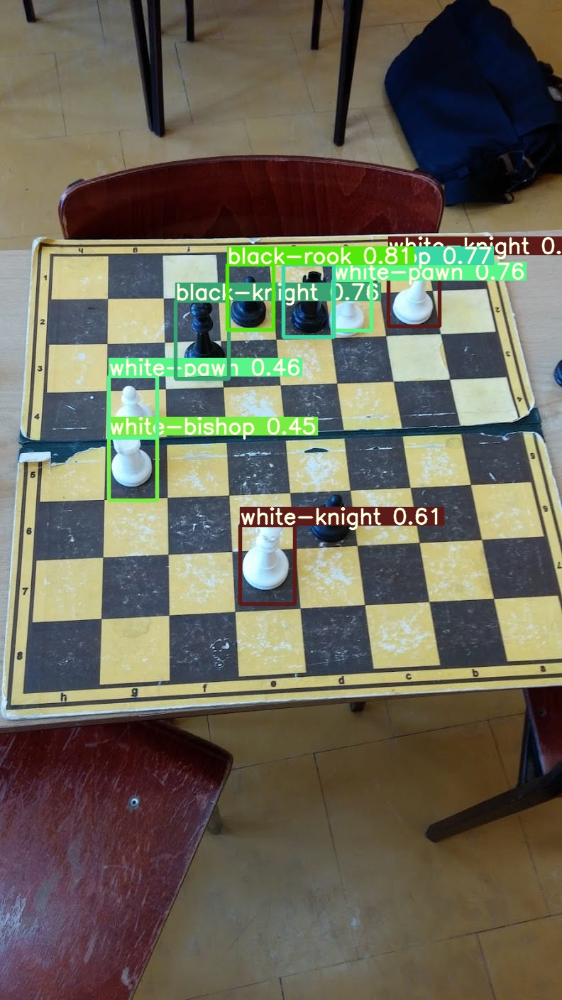
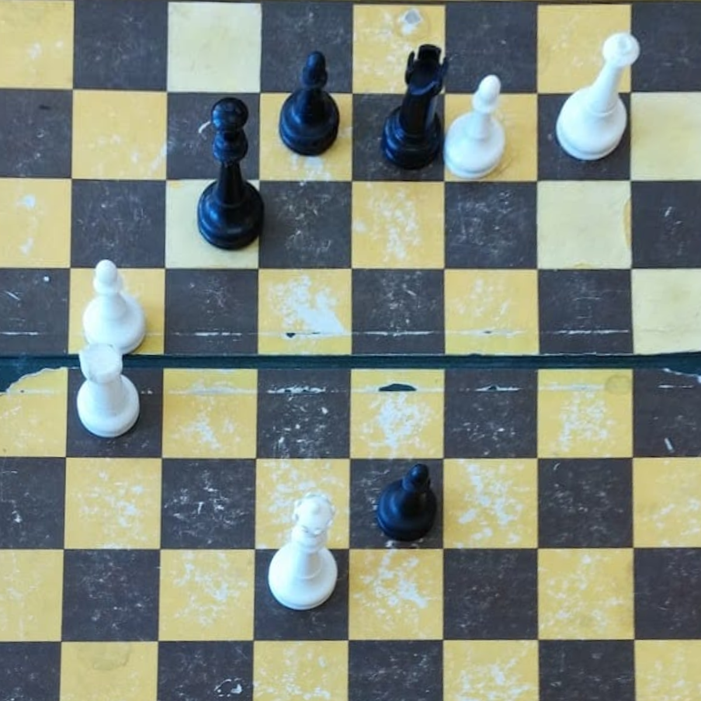
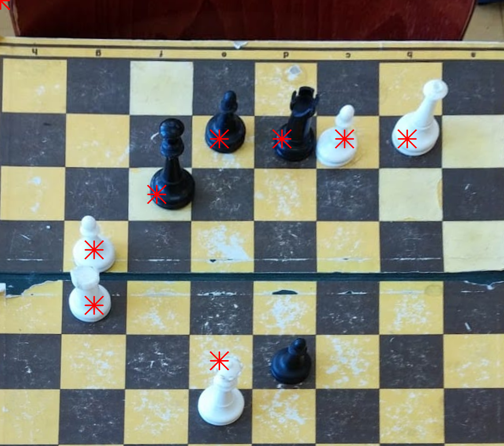
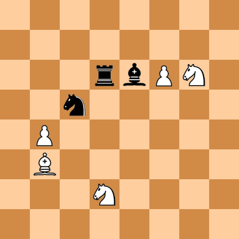

# chess_mapper

Chess_mapper is an application to convert an image of a physical chessboard to a digital png version

  

initial image

  

yolov5 piece detection

  

initial centering

  

piece location

  

conversion to digital chessboard

limited by the accuracy of the yolov5 model, requires improved dataset with more varied boards, piece sets, backgrounds and lighting.
